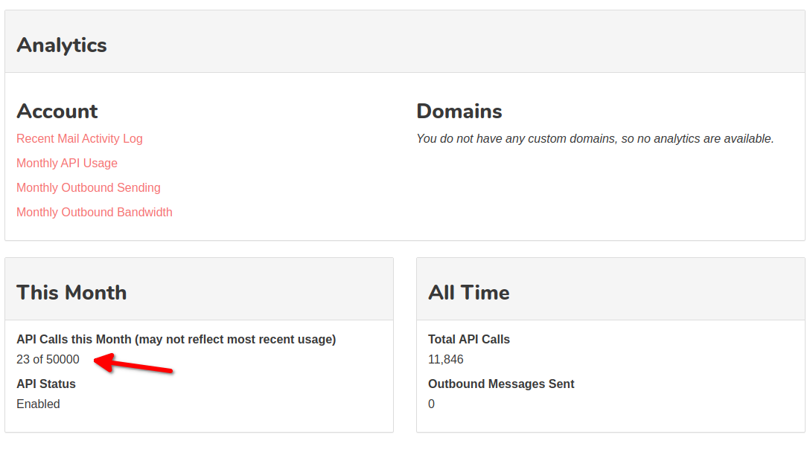
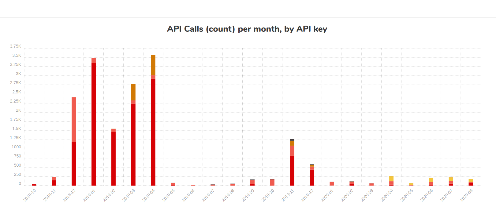

.. _Dashboard: https://mailsac.com/dashboard
.. _`Manage Account Details`: https://mailsac.com/account
.. _`REST API`: https://mailsac.com/api
.. _`Ops Usage`: https://mailsac.com/usage
.. _`Sub-Account User Login`: https://mailsac.com/login-api-key

.. _doc_account_management:

Account Management
==================

The following account details are configurable via `Manage Account Details`_
on the Dashboard_:

- Account and Invoice Email Address
- Invoice Company Name and Address
- :ref:`Password Change <sec_password_change>`
- :ref:`Account Deletion <sec_account_deletion>`

Ops Usage
---------

Operations (Ops, formerly "api calls") are calculated based on the following
service usage:

- `REST API`_ calls
- Messages sent to the :ref:`Email Capture Service <doc_email_capture>`
- Messages forwarded to :ref:`Slack <sec_forward_to_slack>`
- Messages forwarded to a :ref:`Webhook <sec_webhook_forwarding>`
- Messages forwarded to a :ref:`WebSocket <sec_websocket_forwarding>`

View Usage
^^^^^^^^^^^^^^

Usage can be viewed by selecting `Ops Usage`_ from the Dashboard_. Current
month usage and historical usage is available. Breakdown by API Key and service
is visible by hovering the mouse over the bar graph in Monthly API Usage.

   Current Month API Usage

   Monthly API Usage

Message Statistics
------------------

Monthly summaries of the following statistics are available per custom domain
and account. Message statistics can be viewed by selecting `Ops Usage`_ from the
Dashboard_.

- Inbound Message Counts
- Inbound Bandwidth

.. _sec_account_deletion:

Account Deletion
----------------

Mailsac accounts can be deleted by submitting an Account Deletion Request from
`Manage Account Details`_.

- Requesting account deletion expresses your intention to fully remove both
  your user account and any existing information relevant to your account.
- This action cannot be undone, and we will be unable to recover any data.

Password Change
---------------

See :ref:`Password Change <sec_password_change>` under
the :ref:`doc_credential_management` page.
