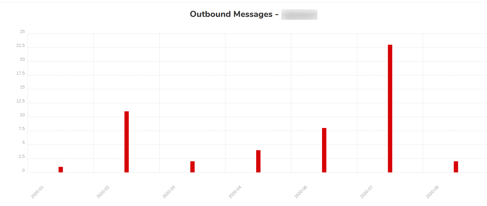

.. _Dashboard: https://mailsac.com/dashboard
.. _`Manage Account Details`: https://mailsac.com/account
.. _`REST API`: https://mailsac.com/api
.. _`API Keys and Users`: https://mailsac.com/api-keys
.. _`API Use`: https://mailsac.com/usage
.. _`Sub-Account User Login`: https://mailsac.com/login-api-key

.. _doc_account_management:

Account Management
==================

The following account details are configurable via `Manage Account Details`_
on the Dashboard_:

- Account and Invoice Email Address
- Invoice Company Name and Address
- :ref:`Password Change <sec_password_change>`
- :ref:`Account Deletion <sec_account_deletion>`

.. _sec_password_change:

Password Change
---------------

An account password can be changed on the Website under
`Manage Account Details`_. If you have forgotten your password use the
`Password Reset Form <https://mailsac.com/password-reset>`_ to send a password
reset email.

.. _sec_api_key_management:

API Credentials Management
--------------------------

API keys are used to authenticate to the `REST API`_,
:ref:`Email Capture <doc_email_capture>`, :ref:`SMTP <sec_sendingmail_smtp>`,
:ref:`POP3 <sec_reading_mail_pop3>`.

API Keys can be created and deleted in the `API Keys and Users`_ section of the
Dashboard_.

Multiple Named API Credentials
^^^^^^^^^^^^^^^^^^^^^^^^^^^^^^

For accounts on the Indie or Basic plans, only one API key is allowed.

For accounts on Business or Enterprise plans, multiple API keys may be
created, each with a unique name.

Having multiple API keys enables:

* restricted access control
* usage monitoring
* separate API Keys in each app environment

To create a named API key, go to `API Keys and Users`_ from the Dashboard_. Enter a
name for the API Key and select *Generate new API key*. API Keys may only be
viewed once and are not retrievable by the system. API Keys should be treated
with the same security considerations as a password.

.. figure:: add_named_key.png
   :align: center
   :width: 400px

   Create new name API key

Create User Login
^^^^^^^^^^^^^^^^^

User accounts may access a subset of Mailsac functionality - almost
everything except managing the account, billing, and API keys or
user logins.

User accounts can be created from the Dashboard_ under
`API Keys and Users`_. This feature is not enabled for individual
plans, such as Basic and Indie.

.. figure:: create_user_login.png
   :align: center
   :width: 400px

   Create User Login

The password for the user login is automatically created. It can only
be viewed once. The credential can be downloaded as a CSV file.

.. figure:: user_login_credentials.png
   :align: center
   :width: 400px

   User Login Credentials

When logged into the website using an user login, the user session
is restricted from:

- viewing and modifying payment information
- adding or removing API keys
- managing account features
- adding or removing custom domains

Login Using an Sub-Account User
^^^^^^^^^^^^^^^^^^^^^^^^^^^^^^^

Use the `Sub-Account User Login`_ to sign into Mailsac to login
user a Sub-Account User

- **Primary Account ID:** The primary account name used to sign up for Mailsac
- **User Name:** The name of the user login
- **Password:** The password for the user

.. figure:: login_using_sub_account_user.png
   :align: center
   :width: 400px

   Login using a Sub-Account User.

API Usage
---------

API calls are calculated based on the following service usage:

- `REST API`_ calls
- Messages sent to the :ref:`Email Capture Service <doc_email_capture>`
- Messages forwarded to :ref:`Slack <sec_forward_to_slack>`
- Messages forwarded to a :ref:`Webhook <sec_webhook_forwarding>`
- Messages forwarded to a :ref:`WebSocket <sec_websocket_forwarding>`

View API Usage
^^^^^^^^^^^^^^

API Usage can be viewed by selecting `API Usage`_ from the Dashboard_. Current
month usage and historical usage is available. Breakdown by API Key and service
is visible by hovering the mouse over the bar graph in Monthly API Usage.

.. figure:: current_month_api_usage.png
   :align: center
   :width: 400px

   Current Month API Usage

.. figure:: monthly_api_usage.png
   :align: center
   :width: 400px

   Monthly API Usage

Message Statistics
------------------

Monthly summaries of the following statistics are available per custom domain
and account. Message statistics can be viewed by selecting `API Usage`_ from the
Dashboard_.

- Inbound Message Counts
- Outbound Message Counts
- Inbound Bandwidth
- Outbound Bandwidth

   Monthly outbound message count

.. _sec_account_deletion:

Account Deletion
----------------

Mailsac accounts can be deleted by submitting an Account Deletion Request from
`Manage Account Details`_.

- Requesting account deletion expresses your intention to fully remove both
  your user account and any existing information relevant to your account.
- This action cannot be undone, and we will be unable to recover any data.
