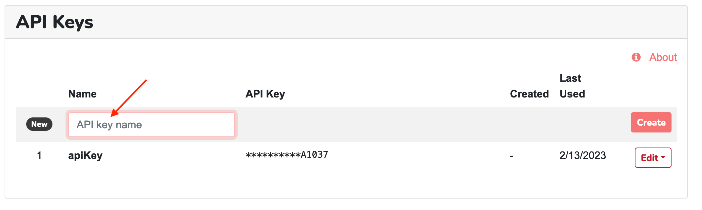

.. _Dashboard: https://mailsac.com/dashboard
.. _`Manage Account Details`: https://mailsac.com/account
.. _`REST API`: https://mailsac.com/api
.. _`API Keys and Users`: https://mailsac.com/api-keys
.. _`Sub-Account User Login`: https://mailsac.com/login-api-key
.. _`Standard Login`: https://mailsac.com/login
.. _`Pricing`: https://mailsac.com/pricing
.. _`SAML/SSO`: https://mailsac.com/v2/saml
.. _`SSO login page`: https://mailsac.com/v2/sso

.. _doc_credential_management:

Credential Management
=====================

There are different ways to authenticate to Mailsac services depending
on the service being consumed.

- `Standard Login`_: Used to authenticate to Mailsac.com Website
- `Sub-Account User Login`_: Used to authenticate to Mailsac.com
  (available to `Business and Enterprise Plans <Pricing_>`_)
- `API Key <API Keys and Users_>`_: Used to authenticate to the `REST API`_,
  :ref:`Email Capture <doc_email_capture>`, :ref:`POP3 <sec_reading_mail_pop3>`.
- POP3 Password: Used to authenticate to :ref:`POP3 Service <sec_reading_mail_pop3>`

.. _sec_password_change:

Password Change
---------------

An account password can be changed on the Website under
`Manage Account Details`_. If you have forgotten your password use the
`Password Reset Form <https://mailsac.com/password-reset>`_ to send a password
reset email.

Sub-Account Users will need to contact the Primary Account Holder to :ref:`reset
their password <sec_sub_account_user_password_reset>`.

.. _sec_api_key_management:

API Key Management
------------------

API keys are used to authenticate to the `REST API`_,
:ref:`Email Capture <doc_email_capture>`, :ref:`POP3 <sec_reading_mail_pop3>`.

API Keys can be created , regenerated, and deleted in the `API Keys and Users`_
section of the Dashboard_.

Multiple API Keys
^^^^^^^^^^^^^^^^^

For accounts on Business or Enterprise plans, multiple API keys may be
created, each with a unique name.

Having multiple API keys enables:

* restricted access control
* usage monitoring
* separate API Keys for different testing environments

To create an API key, go to `API Keys and Users`_  and select "Manage Keys"
from the Dashboard_. Enter a name for the API Key and select
*Generate new API key*. API Keys may only be viewed once and are not
retrievable by the system. API Keys should be treated with the same security
considerations as a password.

   Create new API key

.. _sec_sub_account_user:

Sub-Account Users
-----------------

Sub-Account User accounts may access a subset of Mailsac functionality
- almost everything except managing the account, billing, and API keys or
user logins. This feature is available on Business and Enterprise Plans.

A Sub-Account User's password serves both as the password to the Mailsac.com
website and the `REST API`_

Create User Login
^^^^^^^^^^^^^^^^^

User accounts can be created from the Dashboard_ under
`API Keys and Users`_ by selecting "Manage Users"

   Create User Login

The password for the user login is automatically created. It can only
be viewed once.

.. figure:: user_login_credentials.png
   :align: center
   :width: 400px

   User Login Credentials

When logged into the website using an user login, the user session
is restricted from:

- viewing and modifying payment information
- adding or removing API keys
- managing account features
- adding or removing custom domains

Login Using an Sub-Account User
^^^^^^^^^^^^^^^^^^^^^^^^^^^^^^^

Use the `Sub-Account User Login`_ to sign into Mailsac to login
user a Sub-Account User

- **Primary Account ID:** The primary account name used to sign up for Mailsac
- **User Name:** The name of the user login
- **Password:** The password for the user

   Login using a Sub-Account User.

.. _sec_sub_account_user_password_reset:

Reset Sub-Account User Password
^^^^^^^^^^^^^^^^^^^^^^^^^^^^^^^

Sub-Account User passwords are generated automatically because they also
serve as an API key. In order to reset the Sub-Account password the user
can be recreated by selecting "Regenerate Password".
This can be done from `API Keys and Users`_

   Regenerate Sub-Account password.

Remove Sub-Account User
^^^^^^^^^^^^^^^^^^^^^^^

Sub-Account users can can be removed by clicking on the "Delete" button next to
the user login on the `API Keys and Users`_ page.

   Remove Sub-Account user.

SAML/SSO Integration
--------------------

SAML provides a way for sub-account users to authenticate using a third party
identity provider. Mailsac has been tested with Okta, Google Workspace, and
Microsoft Cloud based Active Directory products. Other SAML identity providers
may work since SAML is based on a standard framework.

SAML Setup
^^^^^^^^^^

Select `SAML/SSO`_ from the `Dashboard`_. Then click the button
"Generate SAML Service Provider".

   Generate SAML Service Provider

The next screen will contain "Service Provider Info", which will be required by
your identity provider. The section "Identity Provider Settings" will be filled
in with information generated by your identity provider.

   SAML/SSO Settings

The process for configuring your identity provider will vary depending on
the identity provider.

- `Google Workspace Custom SAML Application <https://support.google.com/a/answer/6087519?hl=en>`_
- `Okta Custom SAML Application <https://developer.okta.com/docs/guides/build-sso-integration/saml2/main/>`_
- `Microsoft Azure AD - Enterprise Application <https://docs.microsoft.com/en-us/azure/active-directory/manage-apps/add-application-portal>`_

Adding SAML Users
^^^^^^^^^^^^^^^^^

In order to login using SSO a :ref:`sub-account user <sec_sub_account_user>`
must be created with a username that matches the name ID returned from the SAML SSO
provider. This is typically the username used to authenticate to the
identity provider.

After the user is added as a sub account user they will be able to login
using SAML SSO.

   Add a sub-account user with the same name as returned by the identity provider

Removing SAML SSO Users
^^^^^^^^^^^^^^^^^^^^^^^

SAML SSO :ref:`sub-account users <sec_sub_account_user>` can be removed by
clicking on the "Delete" button next to the user login on the `API Keys and Users`_
page.

Login As a SAML SSO User
^^^^^^^^^^^^^^^^^^^^^^^^

The `SSO login page`_, which can be accessed directly or found via the
`Standard Login`_, is used for SAML SSO logins.

   Select "SSO Login" to login using SSO

Enter the Primary Account ID, which is the Mailsac username used to configure
SAML SSO, and the SSO email or User ID of the SSO user. Select
"Generate SSO link" to be redirected to the SSO provider's login page.

   Enter primary Mailsac account ID and SSO email or User ID and select "Generate SSO link"

Once the identity provider has authenticated the user, the user will be
redirected back the `Dashboard`_ completing the SAML SSO login process.
