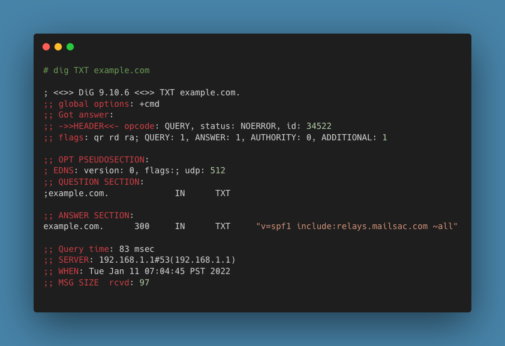

.. _doc_dnsverification:
.. _Dashboard: https://mailsac.com/dashboard
.. _Domains: https://mailsac.com/domains
.. _web based dig: https://toolbox.googleapps.com/apps/dig/

DNS Verification
================

DNS (Domain Name System) is at the core of the internet and email delivery.
When configuring a :ref:`BYO Domain <section_byod_configuration>` DKIM and SPF
records are required to confirm domain ownership and enable outbound mail. MX
records are required to receive mail at Mailsac.

Tools to Verify DNS Records
---------------------------

The command line tool `dig`, which is standard on most Linux distros
and OSX, can be used to verify DNS records. Google hosts an `online
version of dig <web based dig_>`_.

Domain Ownership TXT Record
---------------------------

Mailsac uses a TXT DNS record to verify domain ownership.

The TXT DNS Record is unique per domain. The value of the required TXT
record can be found in the Dashboard_ under Domains_, then click "Manage"
and choose the "DNS Setup" tab.

======== ================= ==================
**Type** **Host**           **Value**
TXT      example.com       mailsac_0rlzMqMyDo2wDF6FuE0x54U5 (Example)
======== ================= ==================

To verify a domain's TXT Record the command line tool `dig`
(`web based dig`_) can be used. In this example, the domain
`example.com` is being used.

.. code-block:: bash

   dig TXT example.com

.. image:: dig_txt_record.png
   :alt: Example result of dig TXT DNS Query

The values in the ``ANSWER SECTION`` show that the records are configured
correctly because it corresponds to the value in the table above.

TXT Record Verification
-----------------------

The values of the MX Records are the :ref:`same <section_email_hosting>` for all
Private and Public Domains hosted by Mailsac. The Host will be unique per
domain.

======== ================= ==================
**Type** **Host**           **Value**
MX       example.com       1 in.mailsac.com
MX       example.com       5 alt.mailsac.com
======== ================= ==================

To verify a domain's MX Records the command line tool `dig`
(`web based dig`_) can be used. In this example, the domain
`example.com` is being used.

.. code-block:: bash

   dig MX example.com

.. image:: dig_mx_record.png
   :alt: Example result of dig MX DNS Query

The values in the `ANSWER SECTION` show that the records are configured
correctly because it corresponds to the value in the table above.

DKIM Record Verification
------------------------

.. note:: Sending outbound SMTP email has been deprecated. DKIM records
   will not will not be validated by mailsac in the future.

DKIM Records are unique per domain. The value of the required DKIM record can
be found in the Dashboard_ under Domains_, then click "Manage" and choose the
"DNS Setup" tab.

======== ========================================== ========================
**Type** **Host**                                   **Value**
TXT      mailsacrelay._domainkey.example.com.       v=DKIM1; k=rsa; p=MI....
======== ========================================== ========================

DKIM Records are a DNS TXT record and can be queried using the command line
tool `dig` (`web based dig`_).

.. code-block:: bash

   dig TXT mailsacrelay._domainkey.example.com.

.. image:: dig_dkim_record.png
   :alt: Example result of dig TXT DNS Query for DKIM

The value in the `ANSWER SECTION` show that the DKIM record is configured
correctly because it corresponds to the value of the provided DKIM record in
the Dashboard_ under Domains_.

SPF Record Verification
-----------------------

.. note:: Sending outbound SMTP email has been deprecated. SPF records
   will not will not be validated by mailsac in the future.

SPF Records are the same for all Private and Public Domains hosted by Mailsac.
The Host will be unique per domain.

======== =================== ======================================
**Type** **Host**            **Value**
TXT      example.com.        v=spf1 include:relays.mailsac.com ~all
======== =================== ======================================

SPF Records are a DNS TXT record and can be queried using the command line
tool `dig` (`web based dig`_).

.. code-block:: bash

   dig TXT example.com.

The values in the `ANSWER SECTION` shows that the record is configured
correctly because it corresponds to the value in in the table above.
