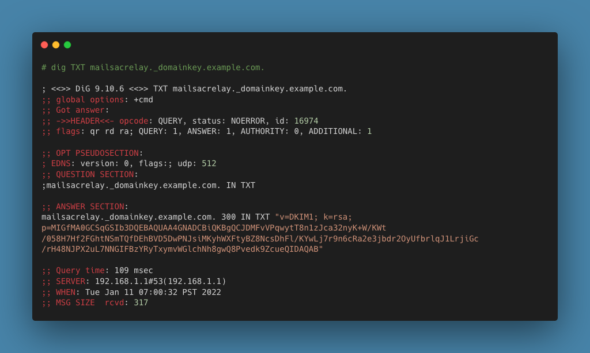

.. _doc_dnsverification:
.. _Dashboard: https://mailsac.com/dashboard
.. _Domains: https://mailsac.com/domains

DNS Verification
================

DNS (Domain Name System) is at the core of the internet and email delivery.
When configuring a :ref:`BYO Domain <section_byod_configuration>` DKIM and SPF
records are required to confirm domain ownership and enable outbound mail. MX
records are required to receive mail at Mailsac.

MX Record Verification
----------------------

The values of the MX Records are the :ref:`same <section_email_hosting>` for all
Private and Public Domains hosted by Mailsac. The Host will be unique per
domain.

======== ================= ==================
**Type** **Host**           **Value**
MX       dogtreats.msdc.co 1 in.mailsac.com
MX       dogtreats.msdc.co 5 alt.mailsac.com
======== ================= ==================

To verify a domain's MX Records the command line tool `dig` can be used.
In this example, the domain `dogtreats.msdc.co` is being used.

.. code-block:: bash

   dig MX dogtreats.msdc.co

The values in the `ANSWER SECTION` show that the records are configured
correctly because it corresponds to the value in the table above.

DKIM Record Verification
------------------------

DKIM Records are unique per domain. The value of the required DKIM record can
be found in the Dashboard_ under Domains_, then click "Manage" and choose the
"DNS Setup" tab.

======== ========================================== ========================
**Type** **Host**                                   **Value**
TXT      mailsacrelay._domainkey.dogtreats.msdc.co. v=DKIM1; k=rsa; p=MI....
======== ========================================== ========================

DKIM Records are a DNS TXT record and can be queried using the command line
tool `dig`. 

.. code-block:: bash

   dig TXT mailsacrelay._domainkey.dogtreats.msdc.co.

The value in the `ANSWER SECTION` show that the DKIM record is configured
correctly because it corresponds to the value of the provided DKIM record in
the Dashboard_ under Domains_.

SPF Record Verification
-----------------------

SPF Records are the same for all Private and Public Domains hosted by Mailsac.
The Host will be unique per domain.

======== =================== ======================================
**Type** **Host**            **Value**
TXT      dogtreats.msdc.co.  v=spf1 include:relays.mailsac.com ~all
======== =================== ======================================

SPF Records are a DNS TXT record and can be queried using the command line
tool `dig`. 

.. code-block:: bash

   dig TXT dogtreats.msdc.co.

.. image:: dig_spf_record.png

The values in the `ANSWER SECTION` shows that the record is configured
correctly because it corresponds to the value in in the table above.