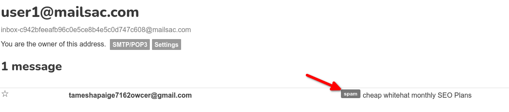
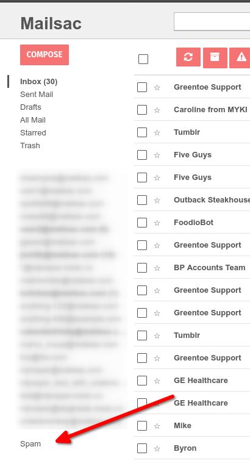
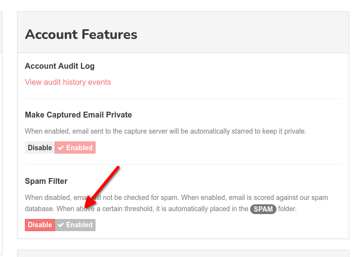

.. _Dashboard: https://mailsac.com/dashboard
.. _deny list: https://mailsac.com/docs/api#tag/Email-Stats-API/paths/~1mailstats~1blacklist/get
.. _Support Forum: https://forum.mailsac.com
.. _Unified Inbox: https://mailsac.com/app
.. _Account Settings: https://mailsac.com

.. _doc_missingmail:

Missing Email
=============

If you have sent email to a *@mailsac.com* address or a private domain hosted
at Mailsac and it was not received, this document will help you find out why.

Sending to an @mailsac.com Address
----------------------------------

If the address you sent to ends in *@mailsac.com* and the message was not
received it could be because of:

* The sender has blocked sending to *@mailsac.com* addresses
* Large message size. The max message size is 2.5MB
* Throttling by Mailsac. If you are sending a large volume of email, we may
  throttle the rate of incoming messages
* The sending SMTP service has a queue
* The sending domain, IP address, or receiving address is on the
  `deny list`_
* The message may have been marked as spam by the :ref:`Spam Filter <sec_spam_filter>`.

.. note::
  If you have a Mailsac subscription you should be sending to
  :ref:`private addresses <doc_private_addresses>` or a
  :ref:`verified custom domain <doc_custom_domains>`. Mail sent to public
  addresses in the mailsac.com domain or a BYOD that has not been verified is
  subject to stricter throttling.

Sending to a Zero-Setup Private Domain (@mydomain.msdc.co)
----------------------------------------------------------

The Zero-Setup Private Domains handle all MX record changes. You can start
receiving email with virtually no setup. If you are still have problems
receiving mail it could be because of:

* Large message size. The max message size is 2.5MB
* The sending SMTP service has a queue
* The sending domain, IP address, or receiving address is on the
  `deny list`_
* The message may have been marked as spam by the :ref:`Spam Filter <sec_spam_filter>`.

Sending to a Bring Your Own Domain (BYOD) Private Domain
--------------------------------------------------------

The BYOD Private Domain requires MX record changes. For assistance in
configuring the MX records see our :ref:`BYODomain Configuration
<section_byod_configuration>`.

* MX Records are incorrect or have no propagated
* Large message size. The max message size is 2.5MB
* The sending SMTP service has a queue
* The sending domain, IP address, or receiving address is on the
  `deny list`_
* The message may have been marked as spam by the :ref:`Spam Filter <sec_spam_filter>`.

Sender Limits
-------------
Some services place restrictions on the size, type, rate, and quantity of
email that can be sent.

GMail
^^^^^
GMail is not designed for sending bulk mail. The service places `limits
<https://support.google.com/mail/answer/22839?hl=en>`_ on the number of
emails sent per day and the number of recipients.

SendGrid
^^^^^^^^
Messages sent through SendGrid are often queued and may not be sent
immediately.

Sending from a `sendgrid.net` address may be impacted by :ref:`throttling <doc_smtp_throttling>`.
Many Mailsac customers use SendGrid. Until `Sender Authentication <https://www.twilio.com/docs/glossary/sender-authentication>`_
is configured within SendGrid, emails will be sent from the `sendgrid.net` domain.
Sending from `sendgrid.net` email address can cause delays in delivery because of the
quantity of mail sent from `sendgrid.net` to `mailsac.com`.
Email sent to a :ref:`Private Address <doc_private_addresses>` or a
:ref:`Custom Domain <doc_custom_domains>` are throttled at a :ref:`higher threshold <doc_smtp_throttling>`.
In order to ensure timely delivery it is recommended to configure sender authentication
in SendGrid and use a private address or custom domain at Mailsac.

Mandrill
^^^^^^^^
Messages sent through Mandrall are often `queued <https://mandrill.zendesk.com/hc/en-us/articles/205582717-Why-does-a-delivered-message-say-queued->`_
and are not sent immediately.

Request Whitelist
-----------------

Whitelisting is only necessary if mail delivery is being slowed due to Mailsac
throttling. A whitelist request can be submitted using the `IP Whitelist Form
<https://mailsac.com/whitelist-request>`_ from the Dashboard_.

Whitelisting can be requested for:

- IP addresses or networks
- Sending domains
- Sending addresses
- Receiving domains
- Receiving addresses

.. _sec_spam_filter:

Spam Filter
-----------

Mailsac applies a spam filter to all incoming email.

In the single inbox view, a "spam" label appears in the subject line.

The `Unified Inbox`_ displays messages classified as spam in the "Spam"
folder. Spam messages skip the inbox.

The spam filter can be controlled at an account level.

To disable or enable the spam filter, select `Account Settings`_ from
the Dashboard_ and toggle the spam filter setting. This change will only
apply to new emails received.

Mailsac Deny List
-----------------

Mailsac does deny email from senders that are impacting the overall
stability of our services. Typically, senders are initially
:ref:`throttled <doc_smtp_throttling>`. If throttling is not effective senders
may be added to the deny list.

Emails from social media and streaming services are blocked. Emails from these
services have been used in ways that are against the :ref:`doc_terms_of_service`.
If you are a QA tester working for a social media company or streaming service
and wish to use Mailsac reach out to our support team.

Contacting Support
------------------

The `Support Forum`_ is available to all customers for assistance or
questions. Customers with email support included in their plan can contact
support@team.mailsac.com.

Including the following information will help us identify why you are not
receiving mail.

* the IP address of your sending server
* the email addresses you are sending to, and/or the domain you are sending TO
* the from email addresses, and/or the domain you are sending FROM
* Time frames when messages were lost. A ball park is ok, like,
  "from 8am - 9am on Dec 3rd GMT we sent 100 messages and only 85 were received"
  or just "I tried sending 5 messages from 8am - 9am GMT Dec 3rd and none of
  them went through"
