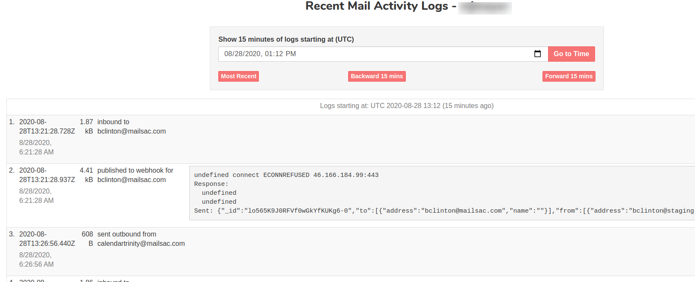

.. _Dashboard: https://mailsac.com/dashboard
.. _pricing: https://mailsac.com/pricing
.. _`Usage and Analytics`: https://mailsac.com/usage

.. _doc_recent_activity:

Recent Activity
===============

Recent Activity shows a detailed log of email received,
:ref:`forwarding <doc_forwarding>`, and :ref:`email sent <doc_sending_mail>`.
This is useful in troubleshooting problems integrating with Mailsac.

Viewing Recent Activity
-----------------------

Recent Activity can be viewed from the Dashboard_, then selecting `Usage and
Analytics`_, then Recent Activity.

   This log shows an email sent through the Mailsac outbound server to
   bclinton@mailsac.com, and a webhook that failed to POST.

The last 15 minutes of activity is available for all users. Extended history
is available for `Business Plan customers <pricing_>`_.
