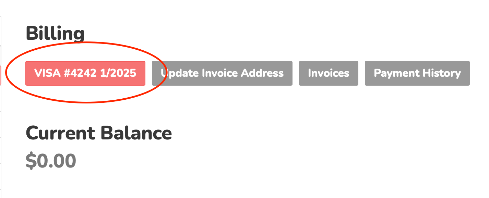

.. _Dashboard: https://mailsac.com/dashboard
.. _Billing: https://mailsac.com/billing

.. _doc_subscriptions_faq:

Subscription Frequently Asked Questions
=======================================

What is the minimal length of subscription term after which I cancel my subscription?
-------------------------------------------------------------------------------------

Subscriptions can be cancelled immediately.

See :ref:`sec_cancel_removal_of_paid_features` for more information.

What is the process for cancellation?
-------------------------------------

Subscriptions can be canceled by selecting `Billing`_ from the `Dashboard`_.
There will be a list of active subscriptions. Selecting "Cancel Subscription"
will present a final verification that you intend to cancel the subscription.

   .. image:: subscription_cancel.png
      :width: 600px
      :align: center

Is the renewal to the next term automatic?
------------------------------------------

Yes, subscriptions that are paid for with a credit card will automatically
renew.

.. _sec_cancel_removal_of_paid_features:

What happens if I cancel my subscription?
-----------------------------------------

Any custom domains, private addresses, and other paid features will be removed.
Cancelling before the end of the term will result in all paid features being removed
immediately. The :ref:`operations (Ops) per month <doc_api_calls>` will immediately
revert to the free tier limits.

.. _sec_billing_apple_pay:

Can I use Apple Pay?
--------------------

Yes, Apple Pay is supported for subscriptions.

When using a supported browser, the Apple Pay button will be displayed at
checkout or when updating the payment method. To change your payment method
to Apple Pay, select `Billing`_ from the `Dashboard`_ and select
"Update Payment Method". See :ref:`sec_billing_update_payment_method` for more
information.

.. _sec_billing_update_payment_method:

How do I update my payment method?
----------------------------------

The payment method can be updated by selecting `Billing`_ from the `Dashboard`_.
Then select "Update Payment Method" button. You will be redirected to our payment
processor to enter your new payment method.

.. _sec_billing_purchase_order:

Can I pay with a purchase order?
--------------------------------

Yes, purchase orders are supported for Enterprise Plan subscriptions.
