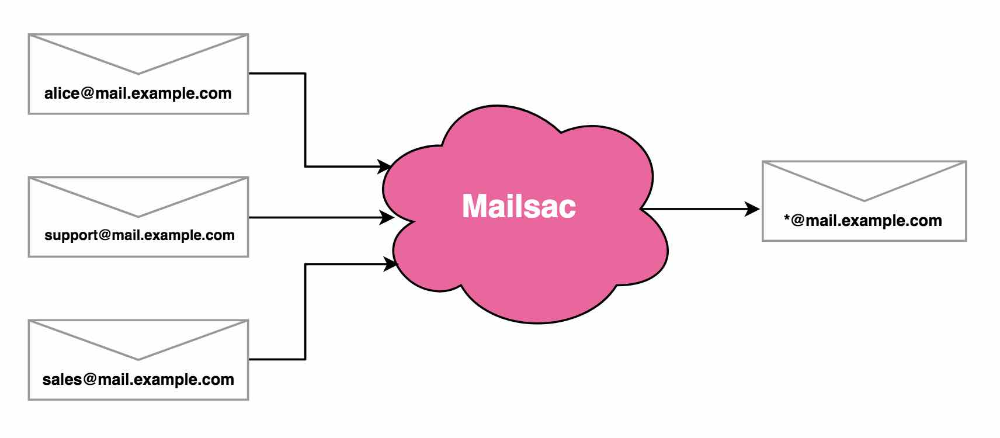

.. _doc_catchall:

Catch-All Email Address Setup
=============================

You can redirect all email on the domain to a single “Catch-All” address, no matter which inbox it was sent to.

This is useful if you are doing testing, or want to give our multiple email addresses that are all checked by one person.

Steps
-----

In the steps below, replace yourdomain.com with your real domain. It can be a
subdomain (mail.yourdomain.com).

1. :ref:`Create DNS MX records <doc_emailhosting>` pointing email for yourdomain.com to the inbound Mailsac servers.
2. `Verify your domain <https://mailsac.com/domains>`_. This may take a few
   minutes – it’s simple, but you must add two DNS TXT records.
3. Go to the `catch-all setup page <https://mailsac.com/catch-all>`_.
4. You will now be able to setup a forwarding address, or just check mail at
   the \* inbox, like \*@yourdomain.com
5. You could also use `POP3 to pull the emails into GMail, Apple Mail, Thunderbird, or any other email client that supports POP3 <https://mailsac.com/docs/fetch-messages-with-pop3>`_.
