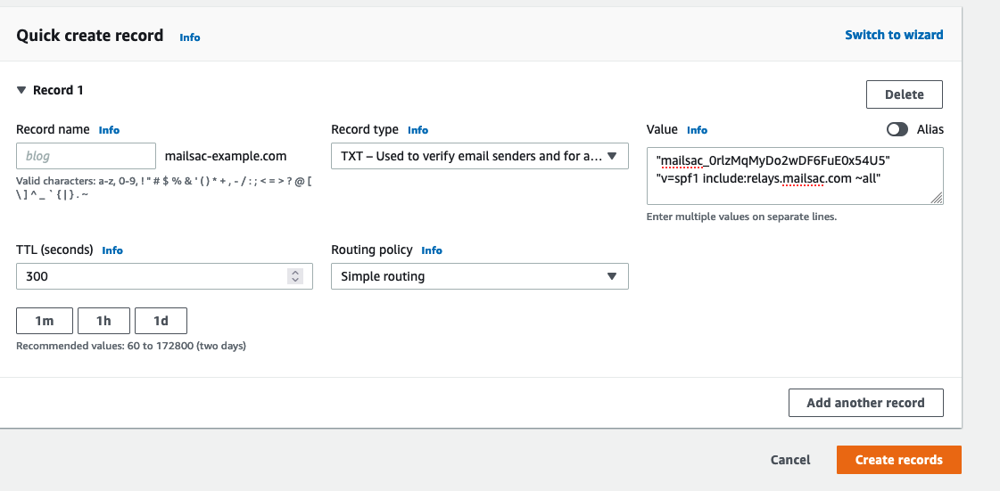

.. _Dashboard: https://mailsac.com/dashboard
.. _dash_custom_domains: https://mailsac.com/domains

.. _doc_custom_domains:

Custom Domains
==============

Mailsac lets you configure a custom domain to receive email at any address
within the domain, while keeping mail private. Mail can be fetched via API and by
logged-in API users, if your plan supports it.

Custom domains have the advantage higher inbound message throttling
limits, greater storage limits, and a Catch-All address. Optionally,
Custom domains can be set to public.

Custom domains `are included with paid subscriptions <https://mailsac.com/pricing>`_.
Additional domains may be added to paid subscriptions.

Zero-Setup Subdomain
--------------------

The Zero-Setup Subdomain automatically creates a subdomain under msdc.co (eg
test123.msdc.co).

It is ready to receive and send email with no additional setup.

This is the ideal option if you do not already own a domain - or do not have
access to change the DNS records for a domain.

`Zero-Setup Subdomain Configuration`_

BYODomain
---------

BYODomain (Bring Your Own Domain) allows you to easily receive email with a
domain or subdomain you already own.

If you do not already own a domain you can use our Zero-Setup Subdomain.
Alternatively, you can purchase a domain from a registrar (`Namecheap
<https://namecheap.com>`__ or `GoDaddy <https://godaddy.com>`_ are popular) and
configure it for use with Mailsac.

The exact method for adding DNS records will depend on your DNS hosting
provider. Your IT department may be able to assist with this. Links to
configuring DNS records for popular :ref:`DNS solutions <sec_mx_record_links>`
are found at the bottom of this page.

`BYODomain Configuration`_

.. _section_zero_setup_subdomain:

Zero-Setup Subdomain Configuration
----------------------------------

Adding a Zero-Setup domain only takes a few seconds.

#. From the Dashboard_, select `Custom Domains <dash_custom_domains_>`_.

   .. image:: dashboard_domains.png
      :scale: 50%
      :align: center

#. Select "Setup a Custom Domain"

   .. image:: setup_custom_domain.png
      :width: 600px
      :align: center

#. Enter a subdomain name and select continue

   .. image:: enter_domain_name.png
      :width: 600px
      :align: center

#. Send a test email to any address at in the custom domain. There is no
   need to configure individual addresses. Sending an email to the address
   creates the address.

#. Enter the email address you sent the email to.

   .. image:: check_mail.png
      :scale: 50%
      :align: center

#. Verify the email was received.

   .. image:: verified_mail.png
      :width: 600px
      :align: center

.. _section_byod_configuration:

BYODomain Configuration
-----------------------

BYODomain configuration requires you to have access to modify DNS records on
your domain.

Domain verification requires the addition of a TXT record to validate domain
ownership.

Receiving mail requires configuring MX records. Sending mail requires
configuring DKIM and SPF records.

The following sections will show how to:

- Add a custom domain to Mailsac
- Verify ownership of a custom domain using a TXT record
- Configure a custom domain to receive mail by adding an MX record
- Configure a custom domain to send mail by adding DKIM and SPF records

Adding a Custom Domain
^^^^^^^^^^^^^^^^^^^^^^

#. From the Dashboard_, select `Custom Domains <dash_custom_domains_>`_.

   .. image:: dashboard_domains.png
      :width: 250px
      :align: center

#. Select "Setup a Custom Domain"

   .. image:: setup_custom_domain.png
      :width: 600px
      :align: center

#. Enter the fully qualified domain name of your domain

    .. image:: byod_enter_fqdn.png
       :width: 600px
       :align: center

#. Select the DNS Setup tab to verify DNS

   "Not Verified - Action Required" indicates DNS is not properly
   configured. The next section explains how to verify
   domain ownership.

    .. image:: byod_select_dns.png
        :width: 600px
        :align: center

.. _sec_verify_domain_ownership:

Verify Custom Domain Ownership
^^^^^^^^^^^^^^^^^^^^^^^^^^^^^^

#. Create a TXT record with the hostname and value found on the DNS Setup
   page under `Custom Domains <dash_custom_domains_>`_.

   See :ref:`sec_txt_record_links` for DNS provider specific
   instructions.

   .. image:: byod_txt_verification.png
      :width: 600px
      :align: center

#. Select "Query My DNS Settings Now"

   Mailsac will attempt to verify domain ownership by querying DNS records for
   the custom domain.

   .. image:: byod_query_dns.png
      :width: 600px
      :align: center

#. Confirm domain ownership.

   If the TXT record is correct, an "OK" image will appear in the
   "DNS Records" section.

   .. image:: byod_txt_verified.png
      :width: 600px
      :align: center

   .. note:: DNS can take up to 24 hours to propagate

.. _sec_configure_mx_records:

Configure Custom Domain for Receiving Mail
^^^^^^^^^^^^^^^^^^^^^^^^^^^^^^^^^^^^^^^^^^

#. Create two MX ("Mail eXchange") records to receive mail with
   the hostname and value found on the DNS Setup page under the
   `Custom Domains <dash_custom_domains_>`_ page.

   .. image:: byod_mx.png
      :width: 600px
      :align: center

   See :ref:`sec_mx_record_links` for DNS provider specific
   instructions

#. Select "Query My DNS Settings Now"

   Mailsac will attempt to verify the MX records for
   the custom domain.

   .. image:: byod_query_dns.png
      :width: 600px
      :align: center

#. Confirm MX records.

   If the MX records are correct, an "OK" image will appear next to the
   "MX Record Type" section of "DNS Records"

   .. image:: byod_mx_verified.png
      :width: 600px
      :align: center

.. _sec_configure_dkim_spf_records:

Configure Custom Domain for Sending Mail
^^^^^^^^^^^^^^^^^^^^^^^^^^^^^^^^^^^^^^^^

.. warning:: Sending outbound SMTP email has been deprecated.

#. Create a TXT record for DKIM (DomainKeys Identified Mail) with
   the hostname and value found on the DNS Setup page under the
   `Custom Domains <dash_custom_domains_>`_ page.

   See :ref:`sec_txt_record_links` and DNS provider specific
   instructions

   .. image:: byod_dkim.png
      :width: 600px
      :align: center

#. Create a TXT record for SPF (Sender Policy Framework) with the
   hostname and value found on the DNS Setup page on the
   `Custom Domains <dash_custom_domains_>`_ page.

   See :ref:`sec_spf_record_links` for DNS provider specific
   instructions

   .. image:: byod_spf.png
      :width: 600px
      :align: center

#. Confirm DKIM and SPF records.

   If the DKIM and SPF records are correct, an "OK" image will appear
   next to the "DKIM Public Key"  and "SPF" section of "DNS Records"

   .. image:: byod_dkim_spf_verified.png
      :width: 600px
      :align: center

Public Custom Domains
^^^^^^^^^^^^^^^^^^^^^

Custom domains can be set as public. API calls for the domain,
its addresses, or messages will be tracked on the domain owner's
account. Viewing message via the website do not count as an Op.

See :ref:`doc_api_calls` for additional details about Ops usage.

.. _sec_mx_record_links:

Multiple TXT Records Using AWS Route53
^^^^^^^^^^^^^^^^^^^^^^^^^^^^^^^^^^^^^^

The TXT records to :ref:`sec_verify_domain_ownership` and SPF both
use top level domain as the record name. In the AWS Route53
console each value will need to be quoted and placed on a separate line.

The code sample shows how the record values should be formatted.

.. code-block:: bash

   "mailsac_0rlzMqMyDo2wDF6FuE0x54U5"
   "v=spf1 include:relays.mailsac.com ~all"`

   Example of formatted values in Route53 AWS Console

DNS Provider MX Record Links
^^^^^^^^^^^^^^^^^^^^^^^^^^^^

.. include:: ./mx_record_links.rst

.. _sec_txt_record_links:

DNS Provider TXT Record Links
^^^^^^^^^^^^^^^^^^^^^^^^^^^^^

.. include:: ./txt_record_links.rst

.. _sec_spf_record_links:

DNS Provider SPF Record Links
^^^^^^^^^^^^^^^^^^^^^^^^^^^^^

.. include:: ./spf_record_links.rst
