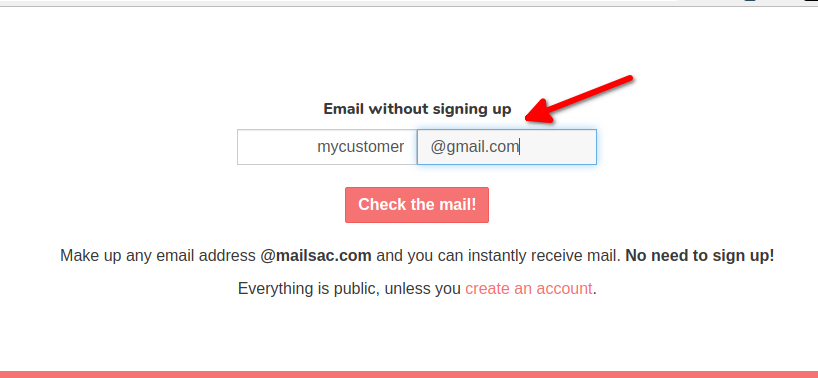

.. _doc_direct_deliver:

.. _Mailsac website: https://mailsac.com
.. _Mailsac API: https://mailsac.com/api

Direct Delivery
===============

Direct Delivery is the service that allows Mailsac to act as a fake SMTP
server. Email messages sent using Direct Delivery will not be delivered to
the intended recipients but instead will be available via the `Mailsac website`_
and `Mailsac API`_.

Email Validation in a Non-Production Environment
------------------------------------------------

Non-production environments of applications often do not send email for fear
that non-production systems may send email to customers. Using Direct Delivery,
emails can be sent and verified using customer email addresses, without the
customer receiving the email.

Sending with Direct Delivery
^^^^^^^^^^^^^^^^^^^^^^^^^^^^

To configure applications to use Direct Delivery replace existing
SMTP configuration with these settings.

- Server Name: `in.mailsac.com`
- Port: 587
- Use Secure Connection: Yes (TLS)
- User Authentication: No

.. tabs::
   .. tab::  Python

      .. literalinclude:: direct_delivery_example.py
         :language: python
         :caption: Send email using Direct Delivery

   .. tab:: Node.js Javascript

      .. pygments throws error because of the \r\n in the code example use force
      .. literalinclude:: direct_delivery_example.js
         :language: javascript
         :force:
         :caption: Send email using Direct Delivery

Validate Email Was Received
^^^^^^^^^^^^^^^^^^^^^^^^^^^

The easiest way to check that an email was received is to use the `Mailsac
website`_. Use the "Check the mail!" button on the
homepage of the `Mailsac website`_ to view the inbox that the email was sent to.

   Check any inbox from the Mailsac homepage

Validating an email was received can also be done using any programming
language that supports HTTP requests, in combination with the `Mailsac API`_.
Code examples for Javascript and Python
are provided.

.. tabs::
   .. tab:: Mailsac Website

      .. figure:: mycustomer_at_gmail.png

         Validate email was received

   .. tab:: curl

       .. literalinclude:: curl_validation.txt
          :language: bash
          :caption: Validate email was received

   .. tab:: Node.js Javascript 

       .. literalinclude:: javascript_validation.js
          :language: javascript
          :caption: Validate email was received

   .. tab:: Python

       .. literalinclude:: python_validation.py
          :language: python
          :caption: Validate email was received

Traditional Email Flow
----------------------

Email traditionally flows from an email client (Mail User Agent - MUA), to a
outbound SMTP server (Mail Transfer Agent - MTA), to the receiving SMTP server
(also an MTA), then to a Mail Delivery Agent (MDA), which is polled by the email
client (MUA) using POP3 or IMAP.

   By Polluks - eigene Arbeit, ArgoUML, CC BY-SA 3.0, https://commons.wikimedia.org/w/index.php?curid=3645799

Along the way, there are typically several places where authentication and
integrity are verified. A sender is typically authenticated when connecting to
an outbound SMTP server. The receiving MTA
will use SPF records, to validate that the sending MTA is allowed to send the
mail, and DKIM records to validate the integrity of the email. Finally, the MUA
authenticates against the MDA, typically using a username and password.

Direct Delivery Email Flow
--------------------------

In the Direct Delivery model the Mail User Agent uses Mailsac's receiving Mail
Transfer Agent as the outbound MTA. The Mailsac MTA will accept all mail,
regardless of the destination domain.

Considerations
--------------

- All email sent will be public (Unless sent to a :ref:`private domain
  <doc_privatedomains>`)
- Email will be throttled
