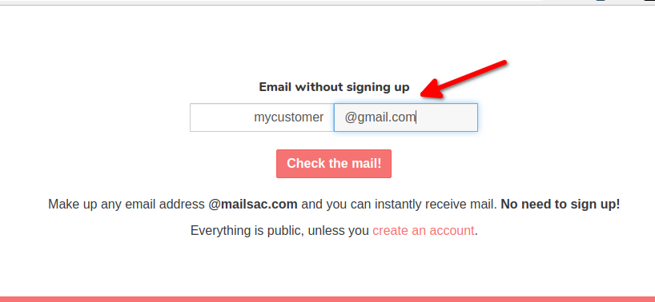
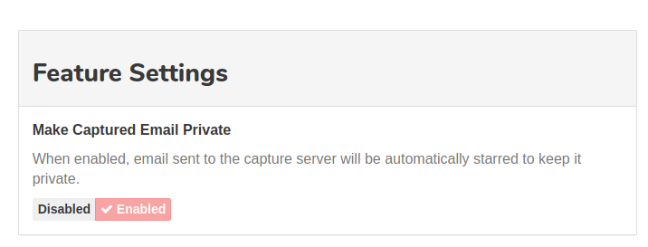

.. _Mailsac website: https://mailsac.com
.. _Mailsac API: https://mailsac.com/api

.. _doc_email_capture:

Email Capture
=============

Email Capture is a fake SMTP relay service you can send to, where Mailsac captures
all the messages.

Email messages sent using Email Capture will not be delivered to
the :code:`To` recipients but instead will be available by looking up the :code:`To`
recipient via the `Mailsac website`_ or `Mailsac API`_.

By default, captured emails are public. To keep captured mail private, toggle the
:ref:`sec_private_captured_email` option in your account settings. This will "star"
captured messages.

Sending Using Email Capture
---------------------------

To configure applications to use Email Capture replace existing
SMTP configuration with these settings.

:Server Name: `capture.mailsac.com`
:Port: 5587
:Use Secure Connection: Yes (TLS)
:User Authentication: Yes (*Username:* Mailsac username
 *Password:* Mailsac: API key)

 Some SMTP libraries or clients may not support the use of a username that is
 different from the :code:`From` address. In that case, the :code:`From` address
 will need to be added as a :ref:`Private Address <doc_private_addresses>` or be
 an address in a :ref:`Custom Domain <doc_custom_domains>`. The
 Private address or address in a Custom Domain can then be used with the Mailsac
 API Key as authentication to the Capture service.

.. tabs::
   .. tab:: Node.js Javascript

      .. literalinclude:: email_capture_example.js
         :language: javascript
         :caption: Send email using Email Capture

   .. tab::  Python

      .. literalinclude:: email_capture_example.py
         :language: python
         :caption: Send email using Email Capture

Validate Email Was Received
---------------------------

The easiest way to check that an email was received is to use the `Mailsac
website`_. Use the "Check the mail!" button on the
homepage of the `Mailsac website`_ to view the inbox that the email was sent to.

   Check any inbox from the Mailsac homepage

Validating an email was received can also be done using any programming
language that supports HTTP requests, in combination with the `Mailsac API`_.
Code examples for Javascript and Python
are provided.

.. tabs::
   .. tab:: Mailsac Website

      .. figure:: mycustomer_at_gmail.png

         Validate email was received

   .. tab:: curl

       .. literalinclude:: curl_validation.txt
          :language: bash
          :caption: Validate email was received

   .. tab:: Node.js Javascript

       .. literalinclude:: javascript_validation.js
          :language: javascript
          :caption: Validate email was received

   .. tab:: Python

       .. literalinclude:: python_validation.py
          :language: python
          :caption: Validate email was received

.. _sec_private_captured_email:

Make Captured Email Private
---------------------------

Emails sent via :code:`capture.mailsac.com` can be automatically
:ref:`starred <sec_starred_messages>`, which keeps the email private, by
enabling the Make Capture Email Private option under `Account Settings
<https://mailsac.com/account>`_. Starred messages count towards
:ref:`doc_message_storage` limits.

Traditional Email Flow
----------------------

Email traditionally flows from an email client (Mail User Agent - MUA), to a
outbound SMTP server (Mail Transfer Agent - MTA), to the receiving SMTP server
(also an MTA), then to a Mail Delivery Agent (MDA), which is polled by the email
client (MUA) using POP3 or IMAP.

   By Polluks - eigene Arbeit, ArgoUML, CC BY-SA 3.0, https://commons.wikimedia.org/w/index.php?curid=3645799

Along the way, there are typically several places where authentication and
integrity are verified. A sender is typically authenticated when connecting to
an outbound SMTP server. The receiving MTA
will use SPF records, to validate that the sending MTA is allowed to send the
mail, and DKIM records to validate the integrity of the email. Finally, the MUA
authenticates against the MDA, typically using a username and password.

Email Capture Flow
-------------------

In the Email Capture model the Mail User Agent uses Mailsac's receiving Mail
Transfer Agent as the outbound MTA (relay). The Email Capture MTA will
accept all mail, regardless of the destination domain.

Considerations
--------------

- All email sent will be public (Unless sent to a :ref:`custom domain
  <doc_custom_domains>` or configured to be
  :ref:`private <sec_private_captured_email>`)
- Each message sent will count as an API call

Email Capture Use Cases
-----------------------

Email Capture can be used anytime a system needs to send an email, but the email
should not be delivered to the customer.

Email Validation in a Non-Production Environment
^^^^^^^^^^^^^^^^^^^^^^^^^^^^^^^^^^^^^^^^^^^^^^^^

Non-production environments of applications often do not send email for fear
that non-production systems may send email to customers. Using Email Capture,
emails can be sent and verified using customer email addresses, without the
customer receiving the email.
