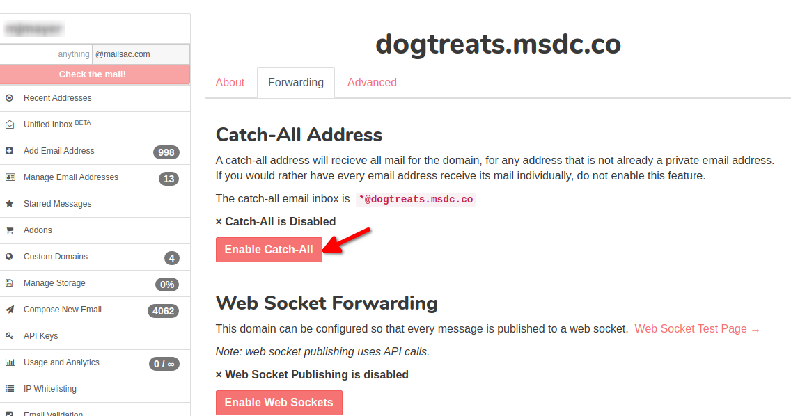
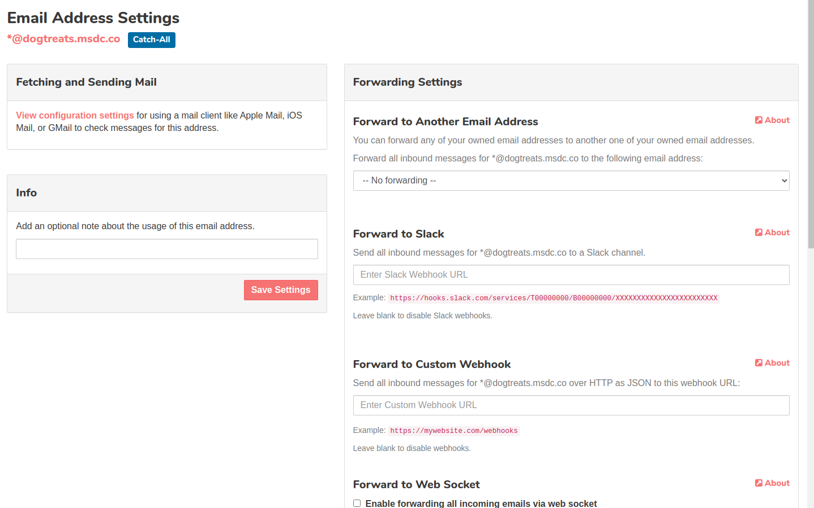

.. _Dashboard: https://mailsac.com/dashboard
.. _`Manage Email Addresses`: http://mailsac.com/addresses
.. _`Manage Domains`: http://mailsac.com/domains

.. _doc_forwarding:

Email Forwarding Overview
=========================

Forwarding, or routing, allows email to be sent on to a further email address
or service (Webhook, WebSocket, Slack Webhook). Private addresses and custom
domains can be configured for email forwarding. Forwarding is not available on
disposable email addresss.

.. _sec_forwarding_catchall:

Catch-All Domain Forwarding Addresses
-------------------------------------

A Catch-All email address can receive all the mail for
a custom domain, and optionally forward it to another address or service (
Webhook, WebSocket, or Slack Webhook). A Catch-All address is a private address
in the format `*@example.com`.

A Catch-All email address can be configured by selecting `Manage Domains`_ from
the Dashboard_, then choosing *Manage* next to the domain, then selecting
the *Forwarding* tab, and toggling the Enable Catch-All.

     Enable Catch-All address on custom domain.

Configure Forwarding on a Catch-All Address
^^^^^^^^^^^^^^^^^^^^^^^^^^^^^^^^^^^^^^^^^^^

Catch-All addresses can be forwarded to:

- :ref:`Another Private Mailsac Address <sec_forward_to_another_mailsac_address>`
- :ref:`Slack <sec_forward_to_slack>`
- :ref:`Webhook <sec_webhook_forwarding>`
- :ref:`WebSocket <sec_websocket_forwarding>`

From the Dashboard_, select `Manage Email Addresses`, then select settings
icon next to the Catch-All address.

    Configure Forwarding on a Catch-All Address

Catch-All Example Use Case
^^^^^^^^^^^^^^^^^^^^^^^^^^

Traditionally individual mailboxes need to be configured
for each address in a domain. If a small business wants to add a new address,
sales@widgets.com, they would need to configure that mailbox. With a Catch-All
address they can instruct customers to start sending to sales@widgets.com and
all the messages sent to sales@widgets.com will be forwarded to the Catch-All
(\*@widgets.com).

Catch-All forwarding makes adding a new email address as simple as sending to
it.

.. _sec_forward_to_another_mailsac_address:

Forward to Another Mailsac Address
----------------------------------

Any private address, in the *@mailsac.com* domain or private domain can be
forwarded to another private address. This allows you to consolidate many email
addresses into a single inbox.

Forwarding to another private address can be configured by selecting
`Manage Email Addresses`_ from the Dashboard_. Select the *Settings* button
next to the email address to manage, then choose the private address to forward
to from the *Forward to Another Email Address* dropdown and select *Save
Settings*

For example, if you own 1@mailsac.com, 2@mailsac.com, 3@mailsac.com, and
main@mailsac.com, you could setup the following scheme:

* 1@mailsac.com forwards to main@mailsac.com
* 2@mailsac.com forwards to main@mailsac.com
* 3@mailsac.com forwards to main@mailsac.com
* main@mailsac.com is checked by POP3 in GMail

.. _sec_forward_to_slack:

Forward to Slack
----------------

Emails sent to a private address or Catch-All can be forwarded
:ref:`to a Slack Channel <doc_slack_webhook>`.

Slack forwarding requires a private address to be configured, but this can be
a custom domain with a Catch-All private address (included with a verified
custom domain).

Forwarding to Slack can be configured by selecting `Manage Email Addresses`_
from the Dashboard_. Select the *Settings* button next to the email address to
manage, then input the Slack Webhook URL and select *Save Settings*.
Step-by-Step instructions are :ref:`provided <doc_slack_webhook>`.

.. _sec_webhook_forwarding:

Forward to Webhook
------------------

Private addresses and Catch-All addresses can have their mail forwarded to a
webhook. :ref:`Configuration <doc_webhook_setup>` of the webhook only requires
a destination URL.

Forwarding to a Webhook can be configured by selecting `Manage Email Addresses`_
from the Dashboard_. Select the *Settings* button next to the email address to
manage, then input the URL under *Forward To Custom Webhook* and select *Save
Settings*.

.. _sec_websocket_forwarding:

WebSocket Forwarding
--------------------

Private addresses and Catch-All addresses can have their mail forwarded to a
WebSocket. A WebSocket uses a single persistent connection to notify a WebSocket
client as soon as a message arrives. The `WebSocket Test Page
<https://sock.mailsac.com>`_ demonstrates a WebSocket.

Forwarding to a WebSocket can be configured by selecting
`Manage Email Addresses`_ from the Dashboard_. Select the *Settings* button next
to the email address to manage, then check the box labeled *Enable forwarding
all incoming email via web socket*, and select *Save Settings*.

A code example for a WebSocket is available :ref:`available
<doc_websocket>`.

Additional information about the WebSocket endpoint, authentication and example
frame format is show in the `API Documentation
<https://mailsac.com/docs/api#tag/Web-Sockets>`_.
