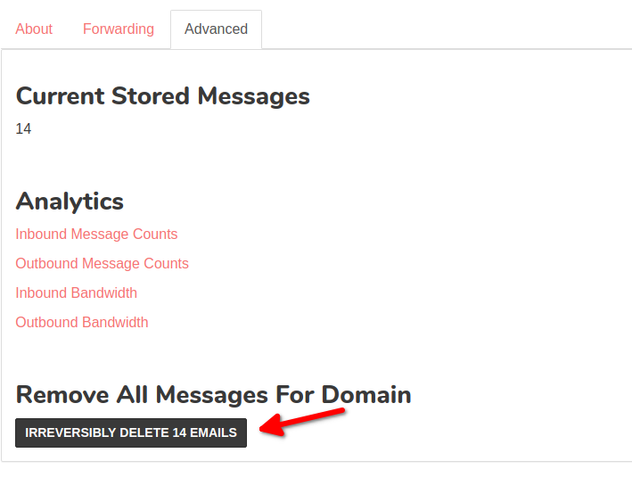

.. role:: red
.. _`Mailsac Website`: https://mailsac.com
.. _`messageId`: https://mailsac.com/docs/api/#example-email-message-object
.. _`List Inbox Email Messages Endpoint`: https://mailsac.com/docs/api/#list-inbox-email-messages
.. _`WebSocket Frame`: https://mailsac.com/docs/api/#example-web-socket-frame
.. _`Webhook`: https://mailsac.com/docs/api/#webhooks
.. _`Unified Inbox`: https://mailsac.com/app
.. _Dashboard: https://mailsac.com/dashboard
.. _`Custom Domains`: https://mailsac.com/domains

.. _doc_message_storage:

Message Storage
===============

Message storage defines how many messages can be stored before mail before
messages are recycled. Messages that are sent to a :ref:`Custom Domain
<doc_custom_domains>`, :ref:`doc_private_addresses`, or `starred messages`_
count towards message storage.

.. _sec_message_recycling:

When are Messages Recycled?
---------------------------

Messages sent to non-private addresses and domains will be recycled at times
to ensure capacity for new messages.
 
Messages sent to :ref:`private domains <doc_custom_domains>`, private addresses,
and `starred messages`_ associated with Mailsac are recycled once the storage 
limit is reached.

Examples
--------

1. If your storage limit is 100 messages and you have starred 125 messages, the
   oldest 25 messages will be recycled.
2. If your storage limit is 100 messages and you have 75 messages in your
   private domain. No messages will be recycled.
3. If your storage limit is 100 messages and you have 150 messages in your
   private domain, the oldest 50 messages will be recycled.
4. If your storage limit is 100 messages and you have 50 messages in 3
   private inboxes (total 150 messages), the oldest 50 messages will be
   recycled.

Getting More Storage
--------------------
Message storage can be purchased on a per-message basis in blocks listed on the 
`pricing page <https://mailsac.com/pricing>`_.

.. _sec_starred_messages:

Starred Messages
----------------
When you star a message, it counts towards your overall storage. 

:red:`Use the star symbol ★`

Your user Dashboard_ has links to all 
inboxes where you starred messages.

You can star messages on any address, including those you own or other 
public addresses.

Managing Storage
----------------

Most customers will never need to manage message storage, since emails are
:ref:`automatically recycled <sec_message_recycling>`.

Messages can proactively be deleted:

- Per message
- Per private inbox
- Per private domain

.. _sec_delete_a_message:

Delete a Message
-------------------

REST API examples require :code:`messageId` parameter. messageId_ can be found
using the `List Inbox Email Messages Endpoint`_, a `WebSocket Frame`_, and
`Webhook POST <Webhook_>`_.

.. tabs::
   .. tab:: Mailsac Website

      .. figure:: delete_message_website.gif

         Delete message using the `Mailsac Website`_

   .. tab:: Unified Inbox

      .. figure:: delete_message_unified_inbox.gif

         Delete using the `Unified Inbox`_ (requires
         :ref:`Private Address <doc_private_addresses>`)

   .. tab:: curl

       .. literalinclude:: delete_message.sh
          :language: bash
          :caption: Delete using curl (requires messageId_)

   .. tab:: Node.js Javascript 

       .. literalinclude:: delete_message.js
          :language: javascript
          :caption: Delete message using Node.js. requires
                    :code:`npm install superagent`

   .. tab:: Python

       .. literalinclude:: delete_message.py
          :language: python
          :caption: Read message using Python

Purge Inbox
-----------

Examples require the Inbox to be a :ref:`Private Address
<doc_private_addresses>`

.. tabs::
   .. tab:: Mailsac Website

      .. figure:: purge_inbox_website.gif

         Purge inbox using the `Mailsac Website`_

   .. tab:: curl

       .. literalinclude:: purge_inbox.sh
          :language: bash
          :caption: Purge inbox using curl (requires messageId_)

   .. tab:: Node.js Javascript 

       .. literalinclude:: purge_inbox.js
          :language: javascript
          :caption: Purge inbox using Node.js. requires
                    :code:`npm install superagent`

   .. tab:: Python

       .. literalinclude:: purge_inbox.py
          :language: python
          :caption: Purge inbox using Python

Purge Domain
------------

All messages in a verified domain can be deleted.

From the Dashboard_, select `Custom Domains`_, select manage next to the domain,
click on the advanced tab, and click on the button "Irreversibly Delete Emails".

