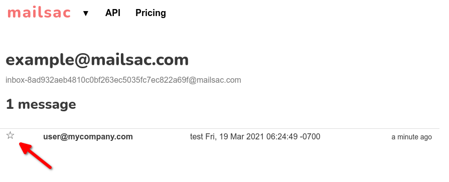

.. role:: red
.. _`Mailsac Website`: https://mailsac.com
.. _`List Inbox Email Messages Endpoint`: https://mailsac.com/docs/api#tag/Email-Messages-API/paths/~1addresses~1{email}~1messages/get
.. _`Star Message Endpoint`: https://mailsac.com/docs/api#tag/Email-Messages-API/paths/~1addresses~1{email}~1messages~1{messageId}~1star/put
.. _`WebSocket Frame`: https://mailsac.com/docs/api#tag/Web-Sockets
.. _`Webhook`: https://mailsac.com/docs/api#tag/Webhooks
.. _`Unified Inbox`: https://mailsac.com/app
.. _Dashboard: https://mailsac.com/dashboard
.. _`Custom Domains`: https://mailsac.com/domains
.. _`REST API`: https://mailsac.com/api
.. _`rest_delete_all_by_domain`: http://mailsac.com/docs/api#tag/Email-Messages-API/paths/~1domains~1{domain}~1delete-all-domain-mail/post

.. _doc_message_storage:

Message Storage
===============

Message storage defines how many messages can be stored before
the oldest messages are recycled. Messages in
:ref:`Custom Domains <doc_custom_domains>`, :ref:`doc_private_addresses`,
and :ref:`starred messages <sec_starred_messages>` count towards message
storage.

.. _sec_message_recycling:

When are Messages Recycled?
---------------------------

The oldest messages in :ref:`Custom Domains <doc_custom_domains>` and
:ref:`Enhanced Addresses <doc_private_addresses>` are recycled once the
storage limit is reached.

Messages sent to non-private (non-enhanced) addresses and unverified domains are kept for
a maximum of 4 days, though messages may be recycled earlier to ensure
capacity for customers on a paid subscription. There is a limit of 6
messages per inbox.

Examples
--------

-  If your storage limit is 100 messages and you have starred 125 messages, the
   oldest 25 messages will be recycled.
-  If your storage limit is 100 messages and you have 75 messages in your
   private domain. No messages will be recycled.
-  If your storage limit is 100 messages and you have 150 messages in your
   private domain, the oldest 50 messages will be recycled.
-  If your storage limit is 100 messages and you have 50 messages in 3
   private inboxes (total 150 messages), the oldest 50 messages will be
   recycled.

Getting More Storage
--------------------
Additional message storage can be purchased in the quantities listed on the
`pricing page <https://mailsac.com/pricing>`_.

.. _sec_starred_messages:

Starred (saved) Messages
------------------------

Starred messages in a mailsac.com inbox (ie example@mailsac.com) are
not visible to other customers. Starred messages count towards your
overall storage, but will not be recycled when your storage limit is
reached.

You can star messages on any address, including those you own or other
public addresses.

When viewing an inbox on the website, messages can be starred by
selecting the star symbol next to the message.

Messages can be starred using `Star Message Endpoint`_ using the
`REST API`_.

Managing Storage
----------------

Most customers will never need to manage message storage, since emails are
:ref:`automatically recycled <sec_message_recycling>`.

Messages can proactively be deleted:

- Per message
- Per private inbox
- Per private domain

.. _sec_delete_a_message:

Delete a Message
-------------------

REST API examples require the :code:`messageId` parameter.
:code:`messageId` can be found using the
`List Inbox Email Messages Endpoint`_, a `WebSocket Frame`_, and
`Webhook POST <Webhook_>`_.

Additional code examples are available in the
`REST API Documentation <REST API_>`_.

.. tabs::
   .. tab:: Mailsac Website

      .. figure:: delete_message_website.gif

         Delete message using the `Mailsac Website`_

   .. tab:: Unified Inbox

      .. figure:: delete_message_unified_inbox.gif

         Delete using the `Unified Inbox`_ (requires
         :ref:`Enhanced Address <doc_private_addresses>`)

   .. tab:: curl

       .. literalinclude:: delete_message.sh
          :language: bash
          :caption: Delete using curl (requires :code:`messageId`)

   .. tab:: Node.js Javascript

       .. literalinclude:: delete_message.js
          :language: javascript
          :caption: Delete message using Node.js. requires
                    :code:`npm install superagent`

   .. tab:: Python

       .. literalinclude:: delete_message.py
          :language: python
          :caption: Read message using Python

Purge Inbox
-----------

The Purge Inbox features requires the Inbox to be an :ref:`Enhanced Address
<doc_private_addresses>`.

Additional code examples are available in the
`REST API Documentation <REST API_>`_.

.. tabs::
   .. tab:: Mailsac Website

      .. figure:: purge_inbox_website.gif

         Purge inbox using the `Mailsac Website`_

   .. tab:: curl

       .. literalinclude:: purge_inbox.sh
          :language: bash
          :caption: Purge inbox using curl (requires :code:`messageId`)

   .. tab:: Node.js Javascript

       .. literalinclude:: purge_inbox.js
          :language: javascript
          :caption: Purge inbox using Node.js. requires
                    :code:`npm install superagent`

   .. tab:: Python

       .. literalinclude:: purge_inbox.py
          :language: python
          :caption: Purge inbox using Python

Delete All Messages in a Domain
-------------------------------

All messages in a verified domain can be deleted.

From the Dashboard_, select `Custom Domains`_, select manage next to the domain,
click on the advanced tab, and click on the button "Irreversibly Delete Emails".

.. figure:: purge_domain_website.png
   :width: 400px
   :align: center

Use the `route <rest_delete_all_by_domain_>`_
:code:`api/domains/{domain}/delete-all-domain-mail` to delete all
messages in a verified domain using the `REST API`_
