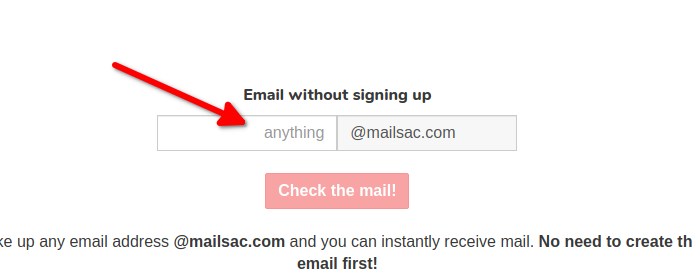
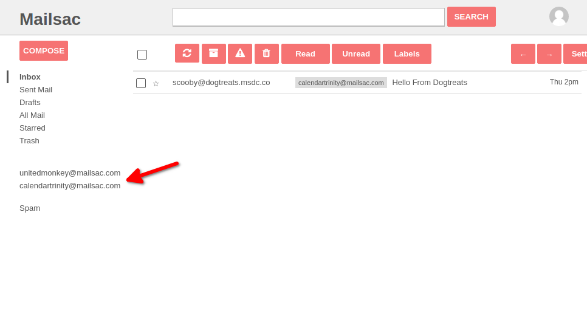

.. _`Mailsac Website`: https://mailsac.com
.. _Unified Inbox: https://mailsac.com/app
.. _Dashboard: https://mailsac.com/dashboard
.. _REST API: https://mailsac.com/api
.. _API Key: https://mailsac.com/api-keys

.. _doc_reading_mail:

Reading Email
=============

There are several ways for to view email messages using Mailsac

- :ref:`Inbox View <sec_inbox_view>`
- :ref:`Unified Inbox <sec_unified_inbox>`
- :ref:`REST API <sec_reading_mail_rest_api>`
- :ref:`POP3 <sec_reading_mail_pop3>`

.. _sec_read_mail_message:

Read an Email Message
---------------------

.. tabs::
   .. tab:: Mailsac Website

      .. figure:: inbox_view_reading_mail.gif

         View Emails from the main page of the `Mailsac Website`_

   .. tab:: Unified Inbox

      .. figure:: unified_inbox_reading_mail.gif

         Read using the `Unified Inbox`_

   .. tab:: curl

       .. literalinclude:: reading_mail.sh
          :language: bash
          :caption: Read using curl. Requires
                    `JQ <https://stedolan.github.io/jq/>`_

   .. tab:: Node.js Javascript

       .. literalinclude:: reading_mail.js
          :language: javascript
          :caption: Read using Node.js. requires
                    :code:`npm install superagent`

   .. tab:: Python

       .. literalinclude:: reading_mail.py
          :language: python
          :caption: Read using Python

.. _sec_inbox_view:

Inbox View
----------

Enter the email address of the Inbox to be viewed in this box on the main page of
the `Mailsac Website`_

An Inbox can be viewed by entering the URL for the Inbox in a browser address
bar. The URL to view an Inbox always follows the format
:code:`https://mailsac.com/inbox/EMAIL_ADDRESS`

Any :ref:`non-private email address <doc_private_addresses>` can be viewed
without creating an account. To view the images and links of a message a Mailsac
account must be used. A free account can be created from the
`sign-up page <https://mailsac.com/register>`_

.. _sec_unified_inbox:

Unified Inbox
-------------

The `Unified Inbox`_ provides a way to view the mail of all
:ref:`private addresses <doc_private_addresses>` for the logged in Mailsac account.

The `Unified Inbox`_ is useful for managing multiple email addresses.

.. _sec_reading_mail_rest_api:

REST API
--------

The REST API is the preferred method for reading messages programmattically.
The :code:`/api/addresses/:email/messages` and
:code:`/api/text/:email/:messageId` endpoints documented in the
`REST API documentation <https://mailsac.com/docs/api/#email-messages-api>`_.

1. Generate an API by selecting `API Keys <https://mailsac.com/api-keys>`_ from
   the Dashboard_.
2. Send email using curl or your favorite HTTP library. :ref:`Code Examples <sec_read_mail_message>`

.. _sec_reading_mail_pop3:

Reading with POP3
-----------------

Reading via POP3 allows email clients to read email.

**Authentication**

POP3 uses a username and password for authentication. The API key or SMTP Key
for your account can be used to read from any of your :ref:`private addresses
<doc_private_addresses>`. Alternatively, you can use a per private address SMTP
password. The per private address SMTP password can be set through using the
Dashboard_ -> *Manage Email Addresses* -> Select the
*POP/SMTP* button next to the email address -> Select *Set New Password*

    .. figure:: ../sending_mail/pop_smtp_set_password.png
        :align: center
        :width: 400px

**Email Client Configuration**

Configure your email client (Gmail, Apple mail, Thunberbird, Outlook, iPhone,
etc) using these POP3 settings:

+-----------------------+-------------------------------------------------------+
| **Hostname / Server** | poppy.mailsac.com                                     |
+-----------------------+-------------------------------------------------------+
| **Email Address**     | Private email address                                 |
+-----------------------+-------------------------------------------------------+
| **Username**          + Private email address                                 |
+-----------------------+-------------------------------------------------------+
| **Password**          | `API Key`_ or SMTP Key                                |
+-----------------------+-------------------------------------------------------+
| **Port**              | 110                                                   |
+-----------------------+-------------------------------------------------------+
| **Auth Settings**     | Password / allow plain / insecure                     |
+-----------------------+-------------------------------------------------------+

To configure a mail client for sending see the :ref:`Sending Mail via SMTP
Section <sec_sendingmail_smtp>`.

.. _sec_reading_mail_attachments:

Viewing Email Attachments
-------------------------

For :ref:`private addresses <doc_private_addresses>`, the `Unified Inbox`_
allows downloading of attachments. Email fetched from private addresses using
:ref:`POP3 from an email client <sec_reading_mail_pop3>`
such as Apple Mail or GMail, will include attachments.

Public email addresses disallow downloading attachments
- :ref:`you must download the entire message file, or fetch attachments
programmatically using the API <doc_attachments>`.

Attachments cannot be hosted publicly for download because attachments often
contain viruses and spam.
