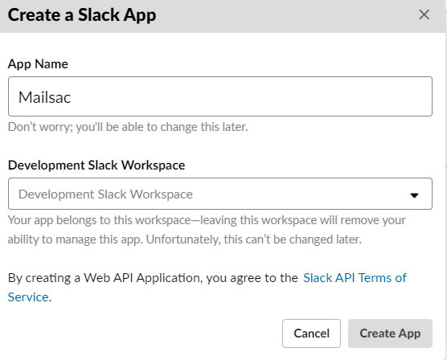
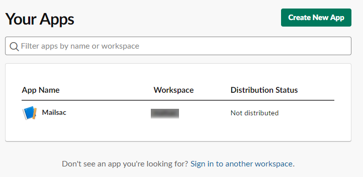
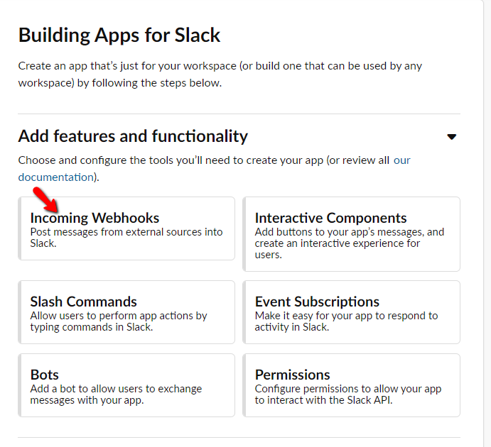
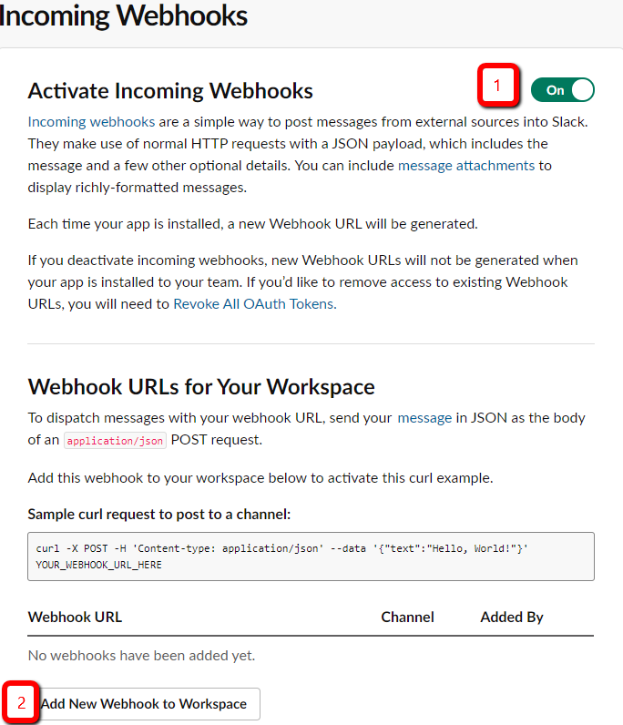
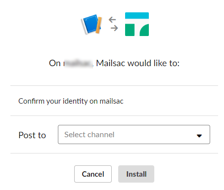
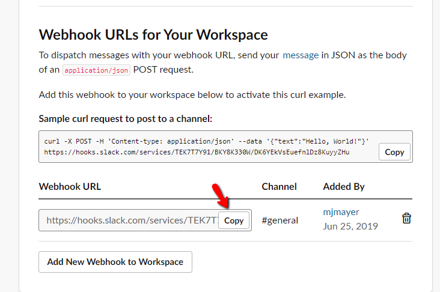
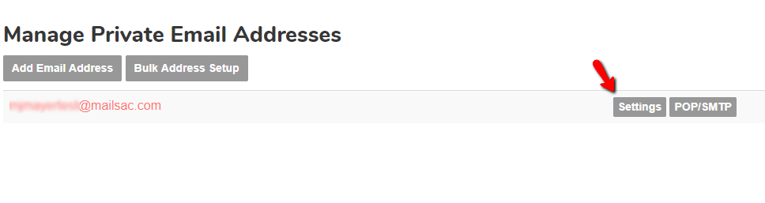

.. _doc_slack_webhook:

Slack Integration
=================

Mailsac integrates seamlessly with Slack. Any Mailsac private address or domain
can be configured to send email to Slack.

Configure Slack Webhook
-----------------------

1. Click this `link <https://api.slack.com/apps/new>`_ to create a new Slack app.
Once signed in define an app name and workspace for your app. In this example,
we are calling the app *Mailsac*.

2. Enable webhooks on your new slack app by selecting your app from this
`list <https://api.slack.com/apps>`_.

Select *Incoming Webhooks* from the *Add features and functionality* dropdown.

From here click the *Activate Incomming Webhooks* toggle to switch it on and select
*Add New Webhook to Workspace*.

3. Configure the Webhook Slack channel by selecting the channel you want the
Mailsac Webhook to post to.

4. Copy Webhook URL

5. Select settings for an email address from the Mailsac `console <https://mailsac.com/addresses>`_
to configure Slack integration.

5. Paste Webhook URL to enable Mailsac Slack Integration

**SCREENSHOT OF SLACK WEBHOOK MAILSAC FORM**

6. Send test email to your Mailsac address you configured for Webhooks to
verify Mailsac can post to the Slack Webhook.

