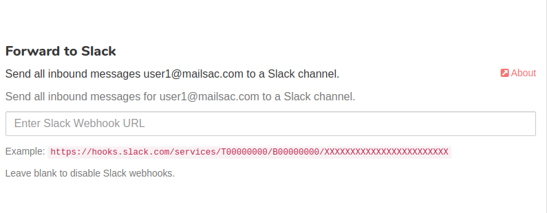

.. _doc_slack_webhook:

Slack Integration
=================

Mailsac integrates seamlessly with Slack. Any Mailsac private address or domain
can be configured to send email to Slack.

Create Slack Application
------------------------

All configuration steps in this section take place on Slack's website. You will
need a Slack username and workspace setup.

**1.** Define an app name for your workspace in the `Slack API
portal <https://api.slack.com/apps/new>`_.

.. figure:: create_slack_app.png
     :align: center
     :width: 400px

     You can call your app Mailsac or customize the name.

**2.** Configure Webhooks for your new Slack app

  **A.** Select your new Slack app from from this
  `list <https://api.slack.com/apps>`_.

  .. figure:: slack_select_app.png
       :align: center
       :width: 400px

  **B.** Select *Incoming Webhooks* from the *Add features and functionality* dropdown.

  .. figure:: slack_select_incomming_webhook.png
       :align: center
       :width: 400px

  **C.** Toggle *Activate Incomming Webhooks* to switch on and select *Add New Webhook to Workspace*.

  .. figure:: slack_activate_webhook.png
       :align: center
       :width: 400px

  **D.** Configure the Webhook Slack channel by selecting the channel you want the
  Mailsac Webhook to post to.

  .. figure:: slack_select_channel.png
       :align: center
       :width: 400px

  **E.** Copy Webhook URL

  .. figure:: slack_copy_webhook_url.png
       :align: center
       :width: 400px

Configure Mailsac Webhook Forwarding
------------------------------------

**1.** Select settings for an email address from the Mailsac `console <https://mailsac.com/addresses>`_
to configure Slack integration.

.. figure:: slack_select_email.png
    :align: center
    :width: 400px

**2.** Paste Webhook URL to enable forward to Mailsac

**3.** Send test email to your Mailsac address you configured for Webhooks to
verify Mailsac can post to the Slack Webhook.

