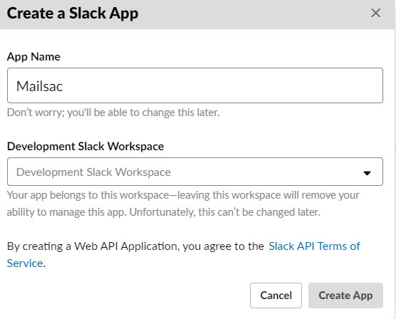
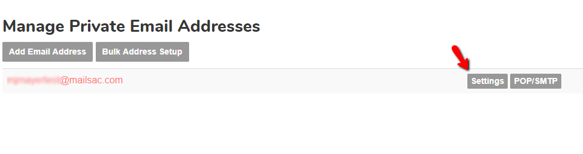
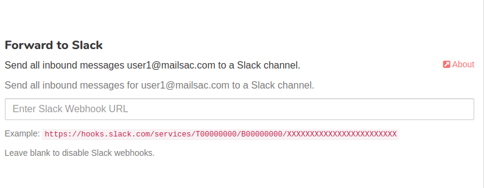
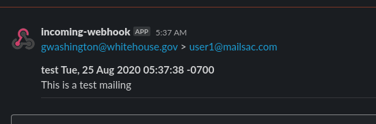

.. _doc_slack_webhook:

Slack Integration
=================

Mailsac integrates email seamlessly with Slack, using Slack webhooks. It works even
on a free Slack workspace. Using a Mailsac enhanced email address, you can configure
forwarding messages directly to a Slack channel.

Forwarding email to Slack is available on
the `The Indie <https://mailsac.com/pricing>`_ and `The Business
<https://mailsac.com/pricing>`_ plans.

Create Slack Application
------------------------

All configuration steps in this section take place on Slack's website. You will
need a Slack username and workspace setup.

**1.** Define an app name for your workspace in the `Slack API
portal <https://api.slack.com/apps/new>`_.

     You can call your app Mailsac or customize the name.

**2.** Configure Webhooks for your new Slack app

  **A.** Select your new Slack app from from this
  `list <https://api.slack.com/apps>`_.

  .. figure:: slack_select_app.png
       :align: center
       :width: 400px

  **B.** Select *Incoming Webhooks* from the *Add features and functionality*
  dropdown.

  .. figure:: slack_select_incomming_webhook.png
       :align: center
       :width: 400px

  **C.** Toggle *Activate Incomming Webhooks* to switch on and select *Add New
  Webhook to Workspace*.

  .. figure:: slack_activate_webhook.png
       :align: center
       :width: 400px

  **D.** Configure the Webhook Slack channel by selecting the channel you want
  the Mailsac Webhook to post to.

  .. figure:: slack_select_channel.png
       :align: center
       :width: 400px

  **E.** Copy Webhook URL

  .. figure:: slack_copy_webhook_url.png
       :align: center
       :width: 400px

.. _sec_configure_address_for_slack_forwarding:

Configure Mailsac Email Address to Forward Messages to Slack
------------------------------------------------------------

**1.** To configure Slack integration, select settings for your enhanced email address from the Mailsac
`console <https://mailsac.com/addresses>`_.

**2.** Paste Webhook URL (from Slack's Create Application UI) into the Slack Webhook box.

**3.** Send a test email to your Mailsac enhanced address. It should post to the Slack channel.

If messages are not being forwarded, you can check `Recent Mail Activity Log <https://mailsac.com/usage>`_ under the Usage
section of the Mailsac dashboard.

Test Slack Webhook
------------------

Send an email to the :ref:`Enhanced Address <doc_private_addresses>`, that was
:ref:`configured for Slack Forwarding
<sec_configure_address_for_slack_forwarding>`.

.. code-block::
   :caption: Send test email using Mailsac's :ref:`doc_email_capture`.

   swaks --server capture.mailsac.com:5587 --to user1@mailsac.com \
       --from gwashington@whitehouse.gov --auth-user $MAILSAC_USERNAME \
       --auth-pass $MAILSAC_API_AKI

   Slack Webhook notification.

Troubleshooting
---------------

If Slack is not receiving the webhook, additional debugging information is
available in :ref:`doc_recent_activity`.
